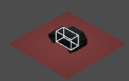
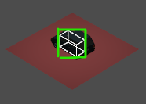

# prototype_bevy_screen_select

## What is it ?

*:construction: :warning: It's under construction: use at your own risk.*

This plugin aims to provide boilerplate to handle multi-selection of objects "à la RTS games":
- click on an object to select it
- click and drag shows a selection rectangle
- release to select objects detected in the rectanble

*[RTS]: Real Time Strategy

## Vision

### Simple

I want the code to remain simple without advanced data structure, so it can serve as an example.

### Lightweight

I'll try to keep the dependency count low, and refrain from adding features if it can be optional.

### Dimension adaptability

It should work on 2d or 3d pretty much the same way:
- add a `Selectable` Component
- (:construction: WIP) Choose a `SelectionWorldData` Component: either a `SelectionBox` or some 2d or custom ones.

### Accept contributions

I am open to contributions, especially on these subjects:

- tests
- examples
- continuous integration setup
- benchmarks
- list and document alternatives

## How does it work ?

- :massage: You add components `Selectable` and `SelectionBox` (could be something else like a sphere or a mesh) to determine how the object will be converted to screen space, its size, shape, etc.
```rs
commands.spawn_bundle((
    SelectionBox {
            origin: Vec3::new(0.0, 0.6, 0.0),
            half_extents: Vec3::new(0.5, 0.6, 1.0),
        },
    Selectable::default()
))
```
<details>
  <summary>:toolbox: The plugin does its magic</summary>
  
- :toolbox: *optionally show a wireframe of the `SelectionBox`*


- :toolbox: the plugin adds a component to represent the converted screen space of your object
- :toolbox: `SelectionBox` is converted in that screen space *and optionally draw a green debug rectangle to show it*


- :toolbox: the plugin has created a UI to show the selection rectangle drag
- :toolbox: internally, a ui is created, to show the selection rectangle drag

- :toolbox: The selection rectangle performs a simple AABB intersection test with visibles `Selectables` to select them.

</details>

- :massage: You get current selection by querying `Selectable` components or querying (:construction: WIP `Res<Selection>`)